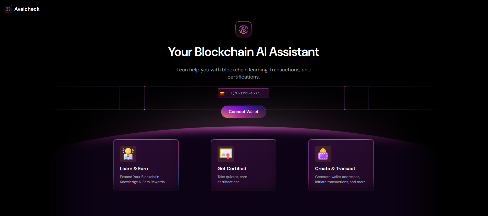
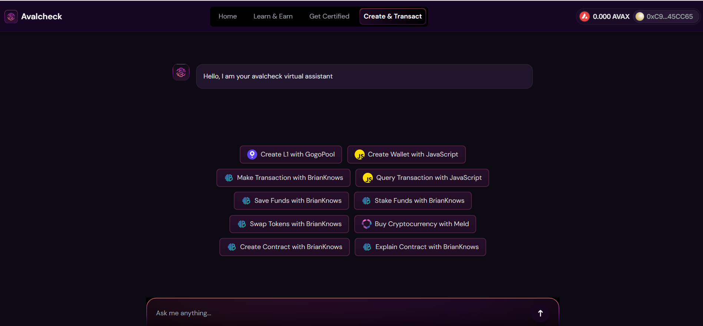

# Avalcheck Monorepo

## Demo

- **Live Demo**: [https://avalcheck.com](https://avalcheck.com)
- **Video Presentation**: [Link to video](#)

Avalcheck is an innovative blockchain-based platform designed to provide a comprehensive learning and transaction experience for users. This monorepo contains two key components: `avalcheck-frontend` and `avalcheck-backend`. Below, you'll find detailed information about each component and how they work together to deliver an exceptional user experience.

### User Interface Preview

## 

## 

## Project Structure

```
avalcheck/
├── avalcheck-frontend/
├── avalcheck-backend/
```

## Frontend

The `avalcheck-frontend` is a React-based web application that allows users to interact with Avalcheck’s features. It includes functionality for learning modules, certifications, and blockchain transactions.

### Features

- **Learn & Earn:** Users can complete modules to earn AVAX rewards.
- **Get Certified:** Take quizzes to gain blockchain certifications.
- **Create & Transact:** Create wallets, perform transactions, and interact with blockchain services.
- **Dynamic UI:** Built using modern React libraries for an intuitive experience.

### Key Dependencies

The frontend is powered by:

- **React 18.3.1**: Core frontend library.
- **Vite**: Build tool for fast development.
- **TailwindCSS**: Styling framework.
- **Wagmi & ethers.js**: Blockchain interaction libraries.
- **GSAP**: Animation library.

### Installation and Usage

#### Prerequisites

- Node.js >= 16.x

#### Commands

1. **Install Dependencies**

   ```bash
   yarn install
   ```

2. **Run Development Server**

   ```bash
   yarn dev
   ```

3. **Build for Production**

   ```bash
   yarn build
   ```

4. **Preview Production Build**
   ```bash
   yarn start
   ```

#### Project Configuration

- TailwindCSS and ESLint are configured for consistent styling and linting.
- Prettier ensures code formatting.

#### Configuration

- Environment variables FRONTEND are used for sensitive data. Create a `.env` file with the following:
  ```env
   VITE_URL=
  ```

## Backend

The `avalcheck-backend` is a NestJS-based API that serves as the backbone of Avalcheck. It provides endpoints for user authentication, data management, and blockchain integration.

### Features

- **Authentication**: Secure JWT-based user authentication.
- **Blockchain Interaction**: Handles wallet creation, transactions, and contract calls.
- **Data Management**: Manages user progress and certifications.
- **Scalable Architecture**: Built with NestJS for modularity and maintainability.

### Key Dependencies

The backend is powered by:

- **NestJS 10.0.0**: Framework for building scalable applications.
- **Prisma**: Database ORM for PostgreSQL.
- **Axios**: HTTP client for external API calls.
- **Puppeteer**: For generating and handling certificates.
- **Class Validator/Transformer**: Input validation and transformation.

### Installation and Usage

#### Prerequisites

- Node.js >= 16.x
- PostgreSQL instance

#### Commands

1. **Install Dependencies**

   ```bash
   npm install
   ```

2. **Run Development Server**

   ```bash
   npm run start:dev
   ```

3. **Build for Production**

   ```bash
   npm run build
   ```

4. **Start Production Server**
   ```bash
   npm run start:prod
   ```

#### Configuration

- Environment variables BACKEND are used for sensitive data. Create a `.env` file with the following:
  ```env
   OPENAI_API_KEY=
   PORT=
   CONEXIONSTARTOKENPROJECT=
   URLCONEXIONSTAR=
   MODELGPT=
   DBINFO=
  ```

## Deployment

### Frontend

- Use any modern hosting service such as Vercel or Netlify. Ensure the `vite.config.js` is properly set for the environment.

### Backend

- Deploy on cloud services like AWS, Azure, or DigitalOcean. Ensure the PostgreSQL database is accessible and environment variables are configured.

## Technologies Used

- **BrianKnows**: Integration for blockchain interaction.
- **Crossmint**: Provides NFT certificate minting functionality.
- **Vapi**: For calling users with AI and making decisions
- **Ethers.js**: JavaScript library for blockchain interactions, including wallet creation and contract transactions.
- **OpenAi**: For creating agent with the base information of the blockchain

## License

This project is licensed under the UNLICENSED license.

---

For any questions or issues, please contact the Avalcheck development team.
